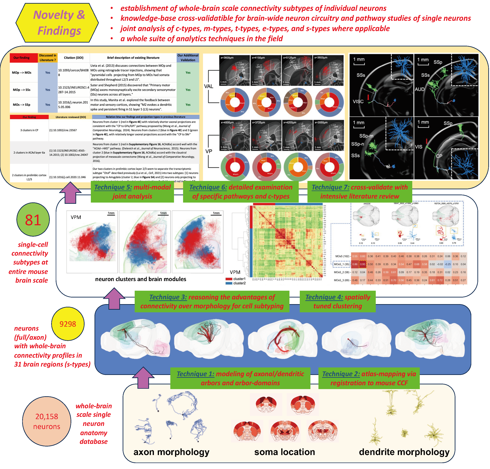

# Connectivity_Type (C-Type)
This repository holds the analytic scripts of the paper: 

[**Anatomical Connectivity of Single Neurons Helps Classify Cell Subtypes in Mouse Brains**](https://pages.github.com/)

> Lijuan Liu†, Zhixi Yun†, Linus Manubens-Gil, Hanbo Chen, Feng Xiong, Hong-Wei Dong, Hongkui Zeng, Michael Hawrylycz, Giorgio Ascoli, Hanchuan Peng*
> 
> advances in somewhere, 202x

  

## Abstract

> Classifications of single neurons at brain-wide scale is a powerful way to characterize the structural and functional organization of a brain. We acquired and standardized a large morphology database of 20,158 mouse neurons, and generated a whole-brain scale potential connectivity map of single neurons based on their dendritic and axonal arbors. With such an anatomy-morphology-connectivity mapping, we defined neuron connectivity types and subtypes (both called “c-types” for simplicity) for neurons in 31 brain regions. We found that neuronal subtypes defined by connectivity in the same regions may share statistically higher correlation in their dendritic and axonal features than neurons having contrary connectivity patterns. Subtypes defined by connectivity show distinct separation with each other, which cannot be recapitulated by morphology features, population projections, transcriptomic, and electrophysiological data produced to date. Within this paradigm, we were able to characterize the diversity in secondary motor cortical neurons, and subtype connectivity patterns in thalamocortical pathways. Our finding underscores the importance of connectivity in characterizing the modularity of brain anatomy, as well as the cell types and their subtypes. These results highlight that c-types supplement conventionally recognized transcriptional cell types (t-types), electrophysiological cell types (e-types), and morphological cell types (m-types) as an important determinant of cell classes and their identities.

-------

Some necessary materials (morphological features etc.) can be downloaded [here](https://braintell.org/projects/mousectype/Materials_0516.zip).
